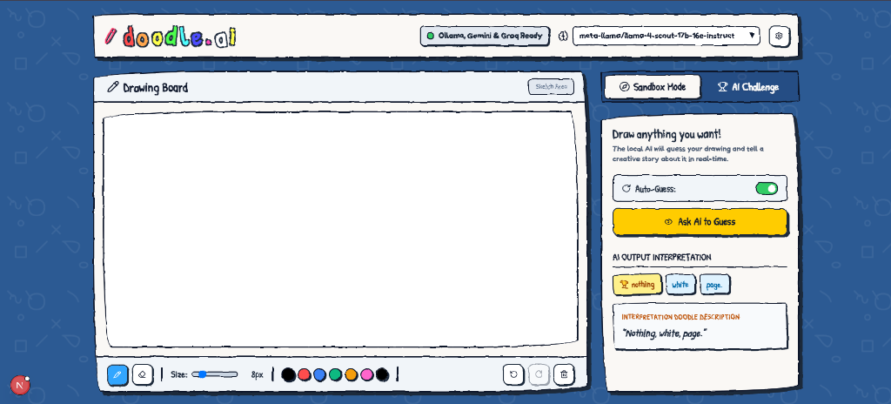
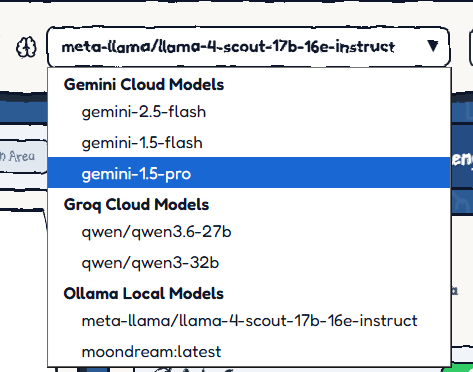

# 🖍️ doodle.ai — Draw & Let AI Guess!

A fun, real-time drawing game where you sketch on a canvas and AI vision models try to guess what you drew. Powered by **Ollama** (local models), **Google Gemini**, and **Groq** cloud APIs.



## ✨ Features

- **🎨 Drawing Canvas** — Full-featured sketch board with brush, eraser, color palette, undo/redo, and adjustable stroke size.
- **🧠 Multi-Model AI** — Choose from local Ollama vision models, Google Gemini cloud models, or Groq cloud models (Qwen & Llama 4 Scout).
- **🔄 Auto-Guess** — AI automatically identifies your drawing in real-time as you sketch.
- **🏆 Challenge Mode** — Timed drawing challenges where the AI races to guess the target word.
- **🎯 Sandbox Mode** — Free-draw mode with creative AI interpretations of your artwork.
- **⚠️ Rate Limit Alarm** — Visual alarm with shaking bell animation when a cloud API's free tier limit is exceeded.
- **⚙️ Configurable** — Easy settings panel for Ollama host, Gemini API key, and Groq API key.

## 🤖 Supported AI Models



| Provider | Models | Type |
|----------|--------|------|
| **Gemini** | `gemini-2.5-flash`, `gemini-1.5-flash`, `gemini-1.5-pro` | Cloud |
| **Groq** | `meta-llama/llama-4-scout-17b-16e-instruct`, `qwen/qwen3.6-27b`, `qwen/qwen3-32b` | Cloud |
| **Ollama** | `moondream`, `llava`, `llama3.2-vision`, and more | Local |

## 🚀 Getting Started

### Prerequisites

- **Node.js** 18+
- (Optional) **Ollama** installed and running for local models
- (Optional) **Gemini API Key** from [Google AI Studio](https://aistudio.google.com/)
- (Optional) **Groq API Key** from [Groq Console](https://console.groq.com/)

### Installation

```bash
# Clone the repository
git clone <your-repo-url>
cd scribble-game

# Install dependencies
npm install

# Set up environment variables
cp .env.local.example .env.local
# Edit .env.local with your API keys
```

### Environment Variables

Create a `.env.local` file in the root directory:

```env
GEMINI_API_KEY=your_gemini_api_key_here
GROQ_API_KEY=your_groq_api_key_here
```

> **Note:** API keys can also be configured directly in the browser via the Settings panel. Keys entered in the UI are stored locally in your browser's localStorage.

### Run Development Server

```bash
npm run dev
```

Open [http://localhost:3000](http://localhost:3000) in your browser.

## 🎮 How to Play

### Sandbox Mode
1. Select an AI model from the dropdown.
2. Draw anything on the canvas.
3. Enable **Auto-Guess** or click **Ask AI to Guess**.
4. Watch the AI interpret your drawing in real-time!

### AI Challenge Mode
1. Switch to the **AI Challenge** tab.
2. Click **Start Game** — you'll be given a word to draw.
3. Draw the word within the 40-second time limit.
4. The AI guesses every 2.5 seconds — earn points for speed!

## 🛠️ Tech Stack

- **Framework:** [Next.js](https://nextjs.org) 16 (App Router)
- **Styling:** TailwindCSS 4 + custom crayon-themed design system
- **UI Components:** shadcn/ui + Lucide icons
- **Fonts:** Patrick Hand (headings) + Fredoka (body)
- **AI Backends:** Ollama REST API, Google Gemini API, Groq OpenAI-compatible API

## 📁 Project Structure

```
src/
├── app/
│   ├── api/
│   │   ├── guess/route.ts    # AI prediction endpoint (Ollama/Gemini/Groq)
│   │   ├── status/route.ts   # Connection & model status checker
│   │   ├── pull/route.ts     # Ollama model downloader (streaming)
│   │   └── words/route.ts    # Random word generator for challenges
│   ├── globals.css           # Design system & custom animations
│   ├── layout.tsx            # Root layout with fonts & SVG filters
│   └── page.tsx              # Main game page (canvas + game logic)
```

## 📄 License

This project is open source and available under the [MIT License](LICENSE).
